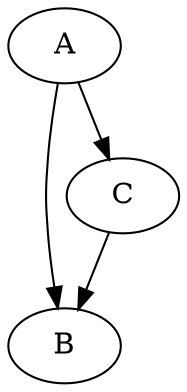

# Foundations of Databases

SSgt Clark, Athan L

_Presented on 20251204_

---

## Outline

1. Introduction
2. Definitions
3. Example Databases
4. Relational Databases
    1. Indexes
    2. Relations
5. Structured Query Language
    1. Create, Read, Update, Delete
    2. Defaults and Constraints

---

## Outline

5. Structured Query Language 
    3. Events and Triggers
    4. Joins
    5. Sub-Queries
6. Advanced Concepts
    1. Views
    2. Stored Procedures
    3. Transactions and Atomicity
7. Security Implications
8. Conclusion

---

## Introduction

> In a nutshell, a database management system is a software system that enables the creation, maintenance, and use of large amounts of data.
> - <u>Foundations of Databases</u> by Serge Abiteboul, Richard Hull, and Victor Vianu

Involve **Diverse Concepts**: Storage Paradigms, Language Models, Precision, Concurrency, Ability to Scale


<!--

Note that it mostly involves stored data. The advent of filesystems (1970's / 80's) changed the paradigm for how database systems should operate.

Databases involve diverse concepts - logical paradigm, query language model, precision, support for concurrency and atomics

-->

---

## Definitions

- Database vs. Database Management System
- Query ~ _"Question"_ or _"Do This"_
- Key / Index ~ Unique Identifier - EDIPI, Item Instance Number
- String, Integer / Floating Point Number, Boolean
    - `"Johnny B."`, `1775` / `5.56`, `FALSE`
- Tuple, Array, Dictionary
    - `("one", 2, 3.15)`, `["Dan Daly", "Smedly Butler"]`, `{ edipi: 12345678, name: "Schmukatelli" }`

<!--

- Query is a means to interact with a database, executed by a DBMS
- Key / Index - uniquely identifies something, can be used to search (EDIPI)
- String (list of characters)
- Tuple (fixed set of different types of things), Array (dynamic set of the same type of thing)
- Table := array of tuples. Columns are different types of things, rows are entries in an array of those tuples

-->

---

## Definitions

- Table, Column, Row

| EDIPI | Name |
| :--- | :---- |
| 1553763807 | `"Clark SSgt Athan L"` |
| 5 | `"Henderson BGen Archibald"` |

| Payment Method | Time | Amount |
| :--- | :---- | ----: |
| VISA1234 | 00:00:00 | $5.00 |
| VISA1234 | 12:11:34 | $7.62 |

---

## Definitions

- Table, Column, Row
```js
[
  (1553763807, "Clark SSgt Athan L"),
  (5, "Henderson BGen Archibald")
]
```

---

## Example Databases

Types of Databases

- Key / Value
- Relational
- Unstructured
- Graph
- Time-Domain

---

## Example Databases - Key / Value

$$ k \hookrightarrow v $$
$$ k \hookrightarrow (v1, v2, v3) $$

> A Value or Tuple of Values **Uniquely Identified** by Some Key

<dl>
<dt>Implementations</dt>
<dd>Redis, Memcached, In-Memory (HashMap, BTree)</dd>
<dt>Features</dt>
<dd>Extremely Fast, Easy to Parallelize (Scalable)</dd>
</dl>

<!-- Very High Performance, Scalable (clusters of DBs) -->

---

## Example Databases - Relational

```erd
[Person]
*name
`birth date`
+birth_place_id

[`Birth Place`]
*id
`birth city`
'birth state'

Person *--1 `Birth Place`
```

> A Table of Values & Keys **Referenced** By Other Tables

<dl>
<dt>Implementations</dt>
<dd>SQL-based; PostgreSQL, MySQL, MSSQL, OracleDB</dd>
<dt>Features</dt>
<dd>Still Pretty Fast, Forces Data Consistency</dd>
</dl>

<!-- Performant, demands data-consistency -->

---

## Example Databases - Unstructured

```js
[
  { serial: "1234", nomen: "TRC-209", color: "Green" },
  { serial: 2TKA1234, nomen: "Warfighting Laptop", weight: 1 },
  { nomen: "mokaju", count: 10 }
]
```

> Collections of Data "Blobs"

<dl>
<dt>Implementations</dt>
<dd>MongoDB, Cassandra, DynamoDB</dd>
<dt>Features</dt>
<dd>Scalable, Flexible for Growing Projects</dd>
</dl>

<!-- Losing some performance, Flexible, But still Scalable - only as fast as how much hardware you throw at it -->

---

## Example Databases - Graph



> Collections of Data "Blobs"

<dl>
<dt>Implementations</dt>
<dd>MongoDB, Cassandra, DynamoDB</dd>
<dt>Features</dt>
<dd>Scalable, Flexible for Growing Projects</dd>
</dl>

<!-- Losing some performance, Flexible, But still Scalable - only as fast as how much hardware you throw at it -->

