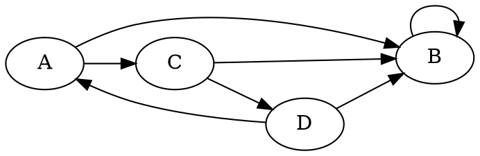
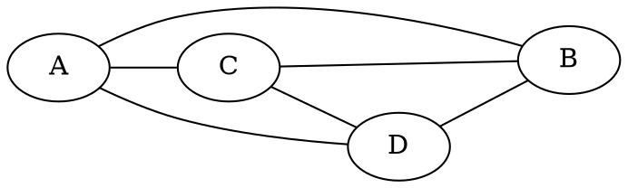

# Foundations of Databases

SSgt Clark, Athan L

_Presented on 20251204_

---

# SSgt Clark

Platoon Sergeant
3D Network Battalion, Detachment Hawaii

- Software Developer for ~15 Years
- Software Engineering & Computer Science Enthusiast
    - Working Toward Degree and PE Licensure
- CompTIA A+, Net+, Sec+, CySA+
- Google Data Analytics, Professional Scrum Master Level 1
- Lean Six Sigma Yellow Belt

---

## Outline

1. Introduction
2. Definitions
3. Example Databases
4. Relational Databases
5. Structured Query Language
6. Advanced Concepts
7. Security Implications
8. Conclusion

---


## Introduction

> In a nutshell, a database management system is a software system that enables the creation, maintenance, and use of large amounts of data.

Diverse Requirements Impose Competition:

Storage Paradigms, Language Models, Precision, Concurrency, Scalability


<!--

Note that it mostly involves stored data. The advent of filesystems (1970's / 80's) changed the paradigm for how database systems should operate.

Databases involve diverse concepts - logical paradigm, query language model, precision, support for concurrency and atomics

-->

---

## Definitions

- **Database** vs. Database Management System (DBMS)
- Query ~ _"Question"_ or _"Do This"_
- Key / Index = Unique Identifier: EDIPI, Item Instance Number
- String, Integer / Floating Point Number, Boolean
    - `"Johnny B."`, `1775` / `5.56`, `FALSE`
- Tuple, Array, Dictionary
    - `("one", 2, 3.15)`, `["Dan Daly", "Smedly Butler"]`, `{ edipi: 12345678, name: "Schmukatelli" }`

<!--

- Query is a means to interact with a database, executed by a DBMS
- Key / Index - uniquely identifies something, can be used to search (EDIPI)
- String (list of characters)
- Tuple (fixed set of different types of things), Array (dynamic set of the same type of thing)
- Table := array of tuples. Columns are different types of things, rows are entries in an array of those tuples

-->

---

## Definitions

- Table, Column, Row - just like Microsoft Excel

| EDIPI | Name |
| :--- | :---- |
| 1553763807 | `"Clark SSgt Athan L"` |
| 5 | `"Henderson BGen Archibald"` |

| Payment Method | Time | Amount |
| :--- | :---- | ----: |
| VISA1234 | 00:00:00 | $5.00 |
| VISA1234 | 12:11:34 | $7.62 |

---

## Definitions

- Table, Column, Row - alternative perspective

```js
[
  (1553763807, "Clark SSgt Athan L"),
  (5, "Henderson BGen Archibald")
]
```

---

# Are We Good?

---

# Are We Good?

## Cool.

---

## Example Databases

Types of Databases

- Key / Value
- Relational
- Unstructured
- Graph
- Time-Domain

---

## Example Databases - Key / Value

$$ k \hookrightarrow v $$
$$ k \hookrightarrow (v1, v2, v3) $$

> A Value or Tuple of Values **Uniquely Identified** by Some Key

<dl>
<dt><strong>Features</strong></dt>
<dd>Extremely Fast, Easy to Parallelize (Scalable)</dd>
<dt><strong>Examples</strong></dt>
<dd>Facebook Messanger, Session Cache</dd>
<dt><strong>Implementations</strong></dt>
<dd>Redis, Memcached, In-Memory (HashMap, BTree)</dd>
</dl>

<!-- Very High Performance, Scalable (clusters of DBs) -->

---

## Example Databases - Relational

```erd
[Person]
*name
+birth_place_id

[`Birth Place`]
*`birth city`

Person *--1 `Birth Place`
```

> Tables of Values & Keys **Referenced** By Other Tables

<dl>
<dt><strong>Features</strong></dt>
<dd>Still Pretty Fast, Forces Data Consistency</dd>
<dt><strong>Examples</strong></dt>
<dd>Blogs, Inventory Management Software, General Purpose</dd>
<dt><strong>Implementations</strong></dt>
<dd>SQL-based; PostgreSQL, MySQL, MSSQL, OracleDB</dd>
</dl>

<!-- Performant, demands data-consistency -->

---

### Example Databases - Unstructured

```js
[
  { serial: "1234", nomen: "TRC-209", color: "Green" },
  { serial: 2TKA1234, nomen: "Warfighting Laptop", weight: 1 },
]
```

> Collections of Data Blobs

<dl>
<dt><strong>Features</strong></dt>
<dd>Scalable, Flexible for Growing Projects</dd>
<dt><strong>Examples</strong></dt>
<dd>Startups, When Final Requirements Aren't Certain</dd>
<dt><strong>Implementations</strong></dt>
<dd>MongoDB, Cassandra, DynamoDB</dd>
</dl>

<!-- 

Losing some performance, Flexible, But still Scalable - only as fast as how much hardware you throw at it

Useful for startups - not sure what final requirements are

-->

---

### Example Databases - Graph

<div class="columns">






</div>

> Nodes and Edges

<dl>
<dt><strong>Features</strong></dt>
<dd>Scalable, Flexible for Growing Projects, Queries that Follow Edges</dd>
<dt><strong>Examples</strong></dt>
<dd>"People you Might Know", Ancestry</dd>
<dt><strong>Implementations</strong></dt>
<dd>Neo4J, SurrealDB</dd>
</dl>

<!--

Useful for complicated relationships between entities - "List everyone's second cousin from this list of people"

-->

---

## Example Databases - Time-Domain

$$ \mathrm{🕑\enspace} \hookrightarrow (v1, v2, v3, v4) $$
$$ \mathbb{R} \hookrightarrow (v1, v2, v3, v4) $$

> Optimized for Time-Based Queries

<dl>
<dt><strong>Features</strong></dt>
<dd>Depends on Underlying Implementation</dd>
<dt><strong>Examples</strong></dt>
<dd>Stock Tickers, Log / Event Queues</dd>
<dt><strong>Implementations</strong></dt>
<dd>TimescaleDB, ElasticSearch</dd>
</dl>

<!--

Stock tickers, log / event queues

-->

---

## Example Databases - Honorable Mentions

- Full-Text Search
- Vector Databases
- Map/Reduce Databases

---

# We O.K.?

---

# We O.K.?

## Cool.

---

## Our Focus - Relational Databases

- Widely Used
- Flexible
- Definite
- Fast

Most Popular Query Language:
**S**tructured **Q**uery **L**anguage (SQL)

---

## Thinking about Data

- Creating Data
- Reading Data
- Updating Data
- Deleting Data

_"CRUD"_

---

## Thinking about Data - In SQL

- Creating Data := `INSERT`
- Reading Data := `SELECT`
- Updating Data := `UPDATE`
- Deleting Data := `DELETE`

_"CRUD"_

---

## Thinking about Data - In SQL

- Creating Data := `INSERT`
- Reading Data := `SELECT`
- Updating Data := `UPDATE`
- Deleting Data := `DELETE`

_"CRUD"_

> Only applies to an existing Table - SQL also permits creating tables, modifying tables, dropping them, etc.

---

# LIVE EXAMPLE

## Create a Simple Table, Add and Manipulate Some Data

---

## SQL

Storage, Modification, Retreival via CRUD

Also Includes Organization, Data Relationships, Enforcement of Laws:
- Table Design
- Indexes / Foreign Keys
- Constraints
- Default Values

<!--

We saw how storage, modification, and retrieval work in SQL by using those statements - note that
they only make sense in context of a specific table.

SQL also permits creation, modification, and deletion of tables as well. Also, the ability to make tables
have "constraints" - uniqueness requirements, conditions, stuff like that. Also default values. Lastly,
the concept of a "foreign key" - meaning that a value can actually reference a key in another table.

-->

---

## SQL - Table Design

| Name | Rank | Favorite Color |
| :--- | :--- | :--- |
| Chesty Puller | MajGen | Green |
| Opha May Johnson | Sgt | |
| Carlos Hathcock | GySgt | Red |

---

## SQL - Table Design - Add Column

| Name | Rank | Favorite Color | Gender |
| :--- | :--- | :--- | :--- |
| Chesty Puller | MajGen | Green | M |
| Opha May Johnson | Sgt | | F |
| Carlos Hathcock | GySgt | Red | M |

Constraints: Gender = _**Not Null**_

---

## SQL - Table Design - Modify Column

| Name | Rank | Favorite Color | Gender |
| :--- | :--- | :--- | :--- |
| Chesty Puller | MajGen | Green | M |
| Opha May Johnson | Sgt | Blue | F |
| Carlos Hathcock | GySgt | Red | M |

Favorite Color Default = _**Blue**_

---

## SQL - Table Design - Drop Column

| Name | Rank | Gender |
| :--- | :--- | :--- |
| Chesty Puller | MajGen | M |
| Opha May Johnson | Sgt | F |
| Carlos Hathcock | GySgt | M |

---

# Live Example

## Table Design

---

# Check-In - Are We Okay?

---

# Check-In - Are We Okay?

## Cool.

---

## SQL - Indexes

| EDIPI | Name | Rank | Gender |
| :--- | :--- | :--- | :--- |
| 1775 | Chesty Puller | MajGen | M |
| 1918 | Opha May Johnson | Sgt | F |
| 762 | Carlos Hathcock | GySgt | M |

Indexes *Must* be Unique

---

## SQL - Foreign Keys

<div class="columns">
<div>
Marines:

<small>

| EDIPI | Name | Rank | Gender |
| :--- | :--- | :--- | :--- |
| 1775 | Chesty Puller | MajGen | M |
| 1918 | Opha May Johnson | Sgt | F |
| 762 | Carlos Hathcock | GySgt | M |

</small>
</div>
<div>
Awards:

<small>

| EDIPI | Award |
| :--- | :--- |
| 1775 | Navy Cross |
| 1775 | Navy Cross |
| 1775 | Navy Cross |
| 1775 | Navy Cross |
| 1775 | Navy Cross |

</small>
</div>
</div>

"Awards EDIPI" is a Foreign Key to "Marines EDIPI"

---

# Live Example

## Indexes and Foreign Keys

---

## SQL - Default Values

Example Concepts:

- Default MCCU Size is "M/R"
- Default Submission Time for a Leave Request that was just created is "Now"
- Default EDIPI is "The Next One"

---

## SQL - Constraints

- Uniqueness Constraints
  - No Marine should have a duplicate email address
- Boundary Constraints
  - All Marines' heights must be greater than 0
- General Purpose and Programmable
  - The IP Address for a device should be in its DHCP Zone

---

# Live Example

## Constraints & Defaults

---

# How are we holding up?

---

# How are we holding up?

## Cool.

---

## Advanced Concepts

1. Events and Triggers
2. Views and Joins
3. Sub-Queries
4. Stored Procedures
5. Transactions and Atomicity

No examples for these because I don't want to waste your time

---

## Events and Triggers

> You can make a query run when something happens to a table

- Prevent a deletion of a row if some criteria is met
- Modify rows in another table if a row is created
- Destroy the entire database if my payroll hasn't been submitted in 1 month (logic bomb)

---

## Views and Joins

> The ability to create partial view of a table or combine data from different tables

- Much higher performance than running multiple queries (important for large datasets like GCSS-MC)
- Useful for making code coherent

---

## Sub-Queries

> Use the results of another query without having to execute it first

_"Select all of my Marines who have done their height and weight this semi-annual period"_


_"Select all of my Marines -> Select their hights and weights for this semi-annual period"_

---

## Stored Procedures

> SQL is not a _"Turing Complete"_ programming language

SQL Can't create arbitrary programs that run forever on its own, but some people are crazy and want that ability in a database

PL/SQL (Oracle), T-SQL (Microsoft), PL/pgSQL (PostgreSQL)

<dl>
<dt>Pros</dt>
<dd>Do anything inside your database</dd>
<dt>Cons</dt>
<dd>Hard to Debug, No Version-Control</dd>

---

## Transactions and Atomicity

> Ability to run Multiple Queries at the same time that affect the same dataset without corruption

Multiple Queries running at the same time can cause a race condition

Atomic Transactions fix this, where conflicting datasets are locked if they're being modified

---

# Did we make it?

---

# Did we make it?

## Cool.

---

## Security Implications

Programmers are often dumb

- How passwords are stored
- Data Integrity - Permanently deleting or modifying data
- Session tokens are often stored in a session table - enables session hijacking

<!---

People that create computer programs actually just kinda do it - sure they get inspected most of the time by
other people, but they can be dumb.

-->

---

## Conclusion


> Databases are designed to **retain**, **access**, and **manipulate** large amounts of data quickly and **preserve** them indefinitely.

SQL is a popular, decent solution to those problems. You'll likely see it again in your professional career.

Slides are available at [github.com/athanclark/usmc-presentation-databases-20251204](https://github.com/athanclark/usmc-presentation-databases-20251204)

---

# Vote on Next Topic

1. Proxmox Virtualization System
    - great for home labs
2. Haskell Programming Language
    - it's like joining a cult
3. CPU Architecture
    - fun!
4. Abstract Algebra
    - don't be afraid

---

# Questions / Comments
